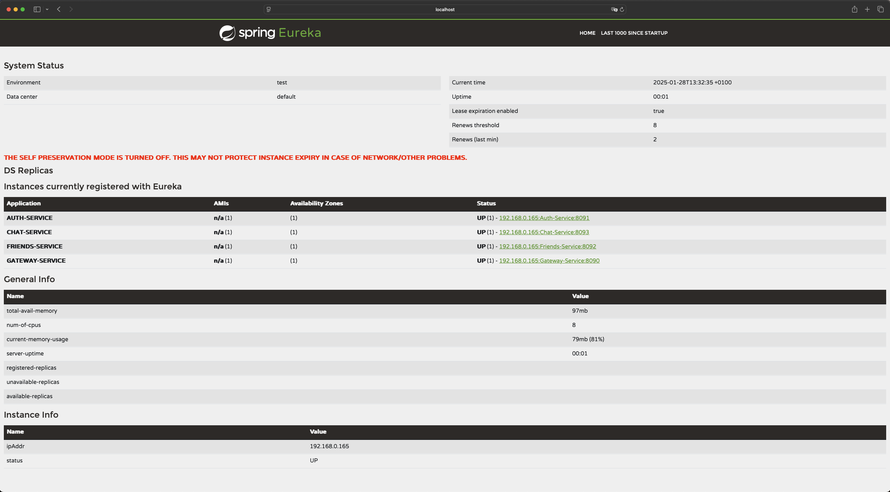

# Chat Service Documentation

## Introduction
Chat-Service is a microservice responsible for managing all conversations between friends. It used queue from RabbitMQ server
to sending messages. The messages are stored in database to create a conversation history. Service has been written by using
technologies:

* Java version 21.0.2
* Spring Boot version 3.3.6
* Spring Cloud version 2023.0.3
* Eureka client: Spring Cloud Netflix Eureka
* Spring Security: for authentication and authorization
* JWT (JSON Web Token): using io.jsonwebtoken for secure validation in the authentication process
* MySQL: using mysql-connector-java version 8.0.33
* Spring Data JPA: for database and ORM access
* Spring AMQP: for message queuing with RabbitMQ
* Spring Web: for building REST APIs and web applications
* Spring WebSocket: for real-time communication with WebSocket support
* Lombok: to reduce boilerplate code in Java
* JUnit & Spring Security Test: for testing with JUnit 5 and Spring Security tools
* Gradle: as a build tool and dependency manager


### Functionality:

* users have ability to write messages with your friends
* message history is available
* displays friends list for each user near the conversation

## Setup and configuration

* [.env.example](.env.example)
* [application.properties](src/main/resources/application.properties)
* [gradle config file](build.gradle)

## How it works?
To run project ensure that all dependencies are installed end you have correctly configured Eureka-Service, Gateway-Service,
Auth-Service, Friends-Service. Run first the Eureka-Service, Eureka-Gateway by entering command:

```shell
mvn spring-boot:run
```
And the next step run Auth-Service, Friends-Service and Chat-Service by entering command:

```shell
./gradlew bootRun
```

Once the Eureka-Service, Eureka-Gateway, Auth-Service, Friends-Service is running, you can access the dashboard by navigating
to the following URL in your browser:

http://localhost:8761

The result should look like this:



### Entity class
This class represents the structure for storing essential friend information in the database,
such as userId, friendId, relationship status:

* [Entity class](src/main/java/Social_Talk/Chat_Service/Model/Message.java)

### The ChatController class
Provides REST APIs for managing sending messages and getting conversation from database:

* [ChatController](src/main/java/Social_Talk/Chat_Service/Controller/ChatController.java)

### API Endpoints


| **HTTP Method**   | **Endpoint**    | **Description**                                  |
|-------------------|-----------------|--------------------------------------------------|
| **POST**          | `/send`         | Send a message from one user to another          |
| **GET**           | `/conversation` | Retrieve the conversation between two users      |

### **Request Parameters**
| **Parameter**   | **Endpoint**        | **Type**  | **Description**                               |
|-----------------|---------------------|-----------|-----------------------------------------------|
| `senderId`      | `/send`             | `int`     | The ID of the user sending the message        |
| `receiverId`    | `/send`             | `int`     | The ID of the user receiving the message      |
| `content`       | `/send`             | `String`  | The content of the message                    |
| `userId1`       | `/conversation`     | `int`     | The ID of the first user in the conversation  |
| `userId2`       | `/conversation`     | `int`     | The ID of the second user in the conversation |


## Important annotations

For the Chat-Service to work properly, make sure that the following annotations have been added to the main
application class:

* **@SpringBootApplication:** this is mandatory for Spring Boot,
* **@EnableEurekaClient:** is used to enable Eureka Client functionality in a Spring Boot application